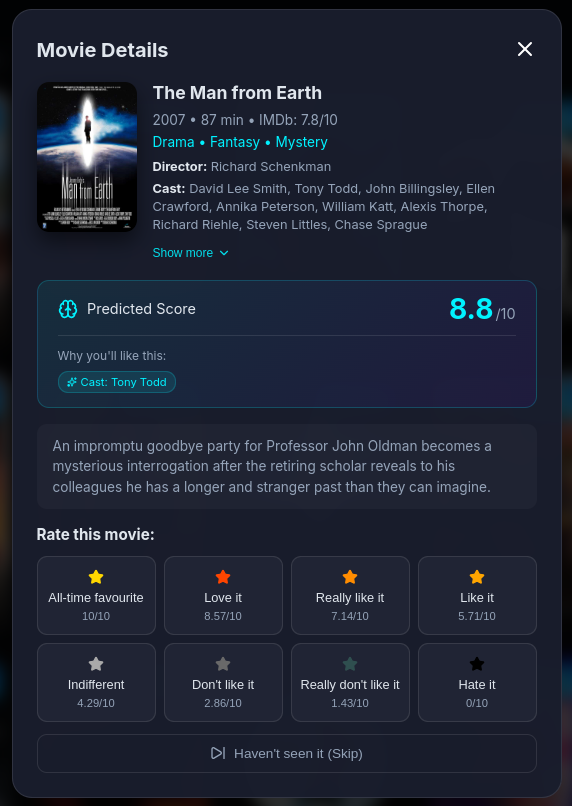
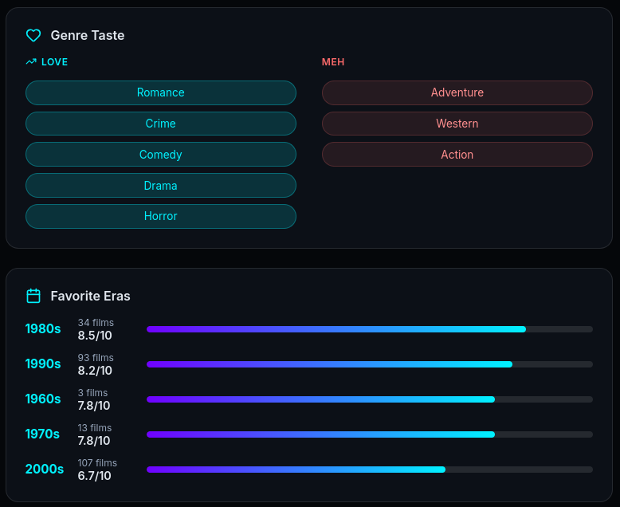

# LINARES

**Latent Inference Network for Audiovisual Rating and Entertainment Suggestion**

LINARES is a personal movie recommendation engine that learns your unique taste through machine learning. You rate movies you've seen; LINARES trains a personalized CatBoost model on your ratings — combining genre/metadata analysis, target-encoded director/actor preferences, and 384-dimensional NLP plot embeddings — then predicts exactly how much you'll enjoy anything else. The result is a private, local recommendation engine that gets meaningfully better the more you use it.

*Named after [Félix Linares](https://es.wikipedia.org/wiki/F%C3%A9lix_Linares), the legendary Basque film critic and presenter of "La Noche de...", whose passion for cinema inspired this project.*





---

## Prerequisites

| Requirement | Version |
|---|---|
| Python | 3.10+ |
| Node.js | 18+ |
| SQLite | bundled with Python |
| Hugging Face account | free — needed for the sentence-transformer model |
| TMDB API key | free — needed for plots, posters, and metadata |

---

## Setup

### 1. Clone and install Python dependencies

```bash
git clone https://github.com/Isonimus/linares
cd linares

python3 -m venv venv
source venv/bin/activate        # Windows: venv\Scripts\activate
pip install -r requirements.txt
```

> **GPU note:** `requirements.txt` installs the CPU build of PyTorch. For GPU acceleration run:
> `pip install torch --index-url https://download.pytorch.org/whl/cu121`

### 2. Configure environment variables

```bash
cp .env.example .env
```

Edit `.env` and fill in your values (see [Environment variables](#environment-variables) below).

### 3. Seed the database

Downloads IMDb's public datasets and filters for movies with 10,000+ votes:

```bash
python setup_database.py
```

### 4. Enrich with posters and plot embeddings

Fetches high-resolution posters, plot summaries, cast, crew, and keywords from the [TMDB API](https://www.themoviedb.org/), then converts plots into dense vector embeddings using the `all-MiniLM-L6-v2` sentence-transformer model. Run multiple times to expand your catalog:

```bash
python fetch_metadata.py 500   # process 500 movies; repeat as desired
```

### 5. Rate movies to build your training set

```bash
python rate_movies.py
```

This opens an interactive CLI. Rate movies on an 8-point scale (All-time favourite → Hate it), which maps internally to a uniform 0–10 continuous scale. **Aim for at least 50 ratings** before training; 100+ gives noticeably better results.

### 6. Train your model

```bash
python train_model.py
```

Trains a CatBoost regressor with 5-fold cross-validation and saves a `.cbm` model file and feature metadata. Prints MAE, R², and a summary of what drives your taste.

### 7. (Optional) CLI predictions

As an alternative to the full UI, `predict.py` lets you get predictions and recommendations directly from the terminal:

```bash
python predict.py
```

It prompts for your profile name, then lets you either predict your score for a specific movie by title or get a ranked list of recommendations with an optional genre filter.

### 8. Start the API

```bash
python api.py
```

The FastAPI backend starts at `http://localhost:8000`.

### 9. Start the frontend

In a separate terminal:

```bash
cd frontend
npm install
npm run dev
```

Open `http://localhost:5173`. From here you can browse personalized recommendations, co-watch suggestions for multiple profiles, rate random movies, search any title, find movies similar to one you already know, and view detailed taste analytics.

---

## Environment variables

All variables live in `.env`. See `.env.example` for a template.

| Variable | Required | Description |
|---|---|---|
| `TMDB_API_KEY` | Yes | TMDB API key for fetching plots, posters, cast, crew, and keywords. Get one at [themoviedb.org/settings/api](https://www.themoviedb.org/settings/api). |
| `HF_TOKEN` | Yes | Hugging Face access token for downloading the sentence-transformer model. Get one at [huggingface.co/settings/tokens](https://huggingface.co/settings/tokens). |
| `ALLOWED_ORIGINS` | No | Comma-separated list of allowed CORS origins. Defaults to `*` (open) for local use. Set to your frontend URL for non-local deployments, e.g. `http://localhost:5173`. |
| `MIN_VOTES` | No | Minimum IMDb vote count for a movie to be included in the catalog. Lower = larger catalog but more obscure titles. Default: `10000`. |
| `SETUP_FETCH_LIMIT` | No | How many movies to pre-fetch plots and posters for during initial setup. The rest can be enriched incrementally with `fetch_metadata.py`. Default: `1000`. |

---

## How the ML model works

### Feature engineering

Raw IMDb metadata is transformed into a feature matrix fed to CatBoost:

- **Temporal** — `decade`, `years_since_release`, `is_classic`, `is_modern`
- **Genre** — 22-column multi-hot encoding + common hybrid combinations (e.g. `combo_action_thriller`)
- **Target encoding (the core)** — For each of directors, writers, actors, composers, and studios, LINARES computes the average score *you* have historically given to every credited person or production company. Features like `dir_avg_rating`, `act_known_count`, and `stu_avg_rating` let the model generalize: *"this user tends to rate films from these studios highly."*
- **Franchise** — `is_franchise` flag indicating whether the movie belongs to a collection (e.g. the MCU, Lord of the Rings)
- **Keywords** — Multi-hot encoding of user-specific plot keywords dynamically selected per user
- **Popularity** — Log-scaled vote count, `is_popular`, `is_obscure` flags
- **Plot embeddings** — 384 dimensions from `all-MiniLM-L6-v2` via `sentence-transformers`. Movies with semantically similar plots cluster together in embedding space even when they share no actors or genres.
- **Maturity/certificate, language, country** — one-hot flags for MPAA ratings and top languages/countries

### Model

**CatBoost Regressor** with `depth=3`, `l2_leaf_reg=5`, `min_data_in_leaf=3`. Heavy regularisation is intentional — individual user datasets are small (50–200 ratings) and overfitting is the primary risk. 5-fold cross-validation is used at training time to report honest MAE and R² estimates.

### Prediction explanations

At inference time, SHAP values identify which features drove the score up or down for a specific movie. The UI surfaces the top reasons in plain English (e.g. *"Cast: Cate Blanchett"*, *"Genre: Drama"*).

---

## Project structure

```
linares/
├── api.py                  # FastAPI backend — all REST endpoints
├── train_model.py          # ML pipeline: feature engineering, CatBoost training, insights
├── features.py             # FeatureMetadata class — consistent feature transforms for train + inference
├── predict.py              # CLI tool for ad-hoc predictions
├── fetch_metadata.py       # Batch TMDB metadata enrichment (plots, posters, crew, keywords)
├── setup_database.py       # DB initialisation from IMDb public datasets
├── rate_movies.py          # CLI rating tool
├── imdb_utils.py           # Movie search and TMDB detail fetching with local DB cache
├── imdb_shared.py          # TMDB fetch helpers and embedding utilities
├── db.py                   # SQLite connection, schema, and DATA_DIR constant
├── config.py               # Rating scale and environment variable loading
├── requirements.txt        # Pinned Python dependencies
├── .env.example            # Environment variable template
├── data/                   # Generated at runtime — not committed
│   ├── movies.db           # SQLite database (created by setup_database.py)
│   ├── model_<user>.cbm    # Trained CatBoost model per user
│   ├── model_<user>_metadata.json
│   ├── model_<user>_insights.json
│   └── catboost_info/      # CatBoost training logs
└── frontend/
    └── src/
        ├── App.jsx                     # Root component — layout and shared state
        ├── constants.js                # API_BASE, FACTORS, page sizes
        ├── hooks/
        │   ├── useRecommendations.js   # Recommendations tab state + fetch logic
        │   ├── useMovieNight.js        # Co-watch tab state + fetch logic
        │   ├── useStats.js             # Stats/insights state + fetch logic
        │   └── useDiscover.js          # Random rating tab state + fetch logic
        └── components/
            ├── RecommendationsTab.jsx
            ├── MovieNightTab.jsx
            ├── StatsTab.jsx           # My Taste tab
            ├── DiscoverTab.jsx
            ├── SearchTab.jsx
            ├── SettingsTab.jsx
            ├── MovieCard.jsx
            ├── MovieModal.jsx
            ├── FactorPills.jsx
            └── Notification.jsx
```

---

## Notes

- **Authentication** is intentionally out of scope — LINARES is a personal/local tool by design.
- **Multiple profiles** are supported: create separate user profiles in the UI and train an independent model for each.
- The catalog grows automatically: searching for a movie that isn't in the local DB triggers a live TMDB fetch of its metadata and embeddings before caching it locally.
- **Similarity search** is available in the Search & Rate tab — hover any result card and click "Find similar" to surface movies with the closest plot embeddings in the catalog.
